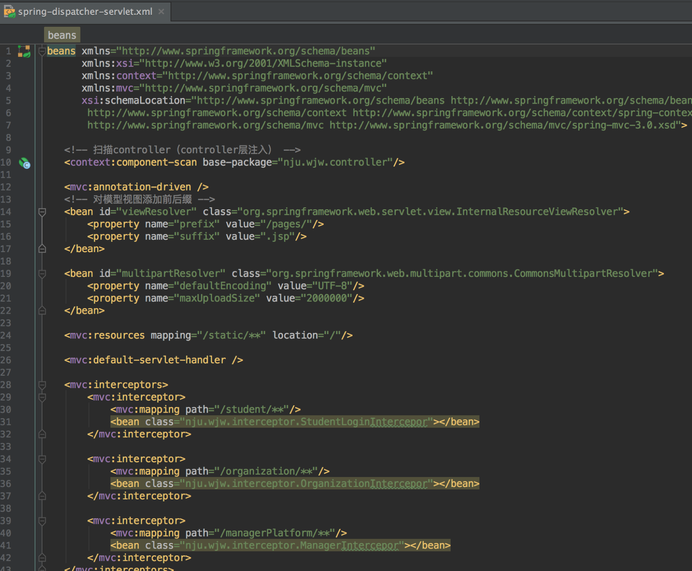
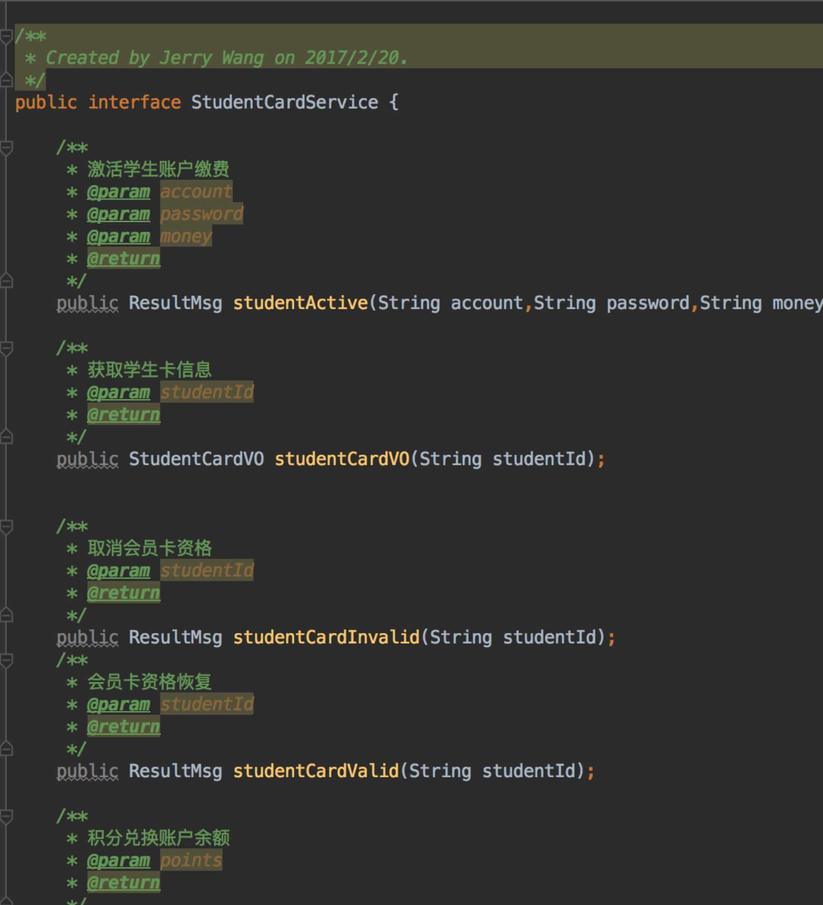
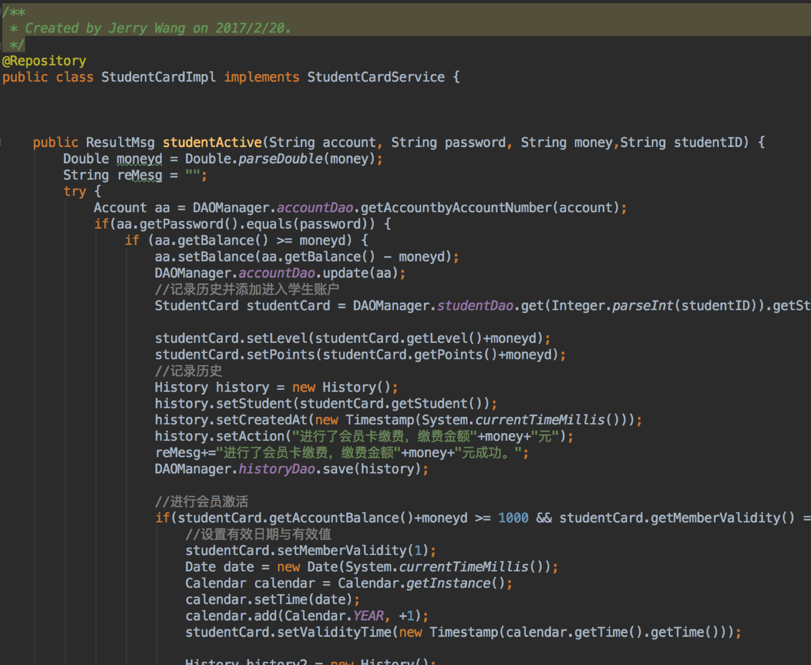

# TrainingSchool
HOMEWORK OF J2EE

A TRAINING SCHOOL

Code in Java

Spring MVC + Spring + Hibernate

目录
一、数据库设计
1.	ER图
2.	数据库表（表名，各列名及数据类型，外键关系）
二、架构设计
2、是否使用框架，如Struts2+Spring+Hibernate 架构
3、前端页面是否使用框架，如bootstrap框架
4、删除的JAR文件截图
三、类设计
1、各包的类：名称及职责
2、前端的页面：名称及功能
四、其他
1、开发环境（数据库，服务器等）
2、其他需要补充的。

一、数据库设计
1.	ER图

2.	数据库表（表名，各列名及数据类型，外键关系）

1）	account

2）	course
其中oid为外键，连接organization

3）	history
其中studentId organizationId managerId均为外键连接表student、organization、manager

4）	manager
其中aid为外键，连接account

5）	organization
其中organizationCard_sid为外键，连接organizaitionCard

6）	organizationCard

7）	score
其中的cid和sid都是外键 连接course表和student表

8）	student
其中的studentCard_sid为外键，连接表studentCard

9）	studentCard

二、架构设计1、工程的项目结构截图；

项目使用了Maven进行整体的包管理，主要依照mvc模式进行分解
controller：前端控制器，控制页面的跳转路由
dao：数据库封装服务层
entity：实体类层 和hibernate中的实体与表中的实现对应
interceptor：拦截器层，对不同的职责用户进行了响应的拦截操作
service：服务层，包含了各种服务的接口和实现
servlet：包含学生卡过期检查的servlet，含有线程判断
util：包含一些常用的返回类型以及错误码和一些公共代码
vo：界面展示层，界面的数据都是由vo封装起来的
2、是否使用框架，如Struts2+Spring+Hibernate 架构；
使用了Spring MVC+Spring+Hibernate的架构

spring mvc配置文件

spring+hibernate配置文件
3、前端页面是否使用框架，如bootstrap框架；
前端使用bootstrap+ jquery以及自己封装的一些组件类，有一些地方使用了jquery的附属js插件 包括使用了font-awesome元素组件等等。
4、删除的JAR文件截图
由于文件使用的是maven进行架构 没有需要删除的jar

如上是maven的pom文件截图
三、类设计
1、各包的类：名称及职责；

controller：springMVC的前端控制器，负责进行转发和路由功能。在这里分成很多个不同页面的转发
LoginController: 登录登出页面的转发
MainController : 主页操作的转发
ManagerController: 经理各种操作的转发
OrganizationController: 机构各种操作的转发
StudentCardController: 学生卡各种服务的转发
StudentController: 学生各项服务操作的前端转发

选取一个作为示例，代表的是学生服务的路由，包括页面的跳转返回等。

dao层：数据库操作封装层。
BaseDao 实现了一种数据库基本Dao的接口。实现了包括增删改查的各种方法
其他各类Dao都是数据库entity层的对应映射关系。

DAOManager是一个Dao的管理器，将这些dao都转化成静态的dao去统一管理

entity是实体类，包含了各种前面介绍到的实体

例如上图是学生的实体类，根据Hibernate进行了映射

拦截器层，包含了三种用户登录的拦截器，是一个安全性功能，防止用户在没有登录的情况下直接访问页面内容而造成的种种影响

例如上图，经理拦截器，除了经理的登录可以直接访问，其他都需要登录才可以

服务层，下面的是接口类，上面的Impl是接口的实现类，用来提供MVC中的核心逻辑层

接口实例

servlet包 包含了检测学生卡是否过期的servlet功能

util分为几部分，前面的scheduletask是一个抽象的任务管理器，可以依据任务管理器添加线程任务。CourseStudentState是描述课程选课状态的枚举类，StudentLevel是描述学员卡信用等级的枚举类。
ResultMsg是一个服务消息的返回类，返回消息的状态和信息

VO是用于界面展示层使用的对象

例如上图 ，向界面层中传入VO就可以使用VO进行界面的展示操作
2、前端的页面：名称及功能

从上到下依次是查看开课申请列表、查看开课申请详情
确认课程列表，确认课程详细信息、课程详细信息
学生眼中的课程列表、网页的footer，网页的header，history通用页面
网站首页、展示信息页面，学员检测等级页面、登录信息页面、经理登录页面
经理服务业、我的课程列表页面、我的成绩页面、新课程开课申请页面、机构详细信息页面、机构历史记录页面、经理眼中机构列表页面、机构登录页面、机构注册页面、注册信息页面、分数检查页面、网站历史信息统计页面、学员卡激活页面、学员卡失效页面、学员卡服务页面、学生历史记录统计页面、学生列表页面、学生登录页面、学生注册页面、学生服务页面、更新课程申请、更新个人信息申请

四、其他
1、开发环境（数据库，服务器等）；
本系统开发在Mac OS系统的IDEA 环境下，使用tomcat服务器，mysql数据库

以上是服务器配置页面
项目使用maven进行包管理与打包
